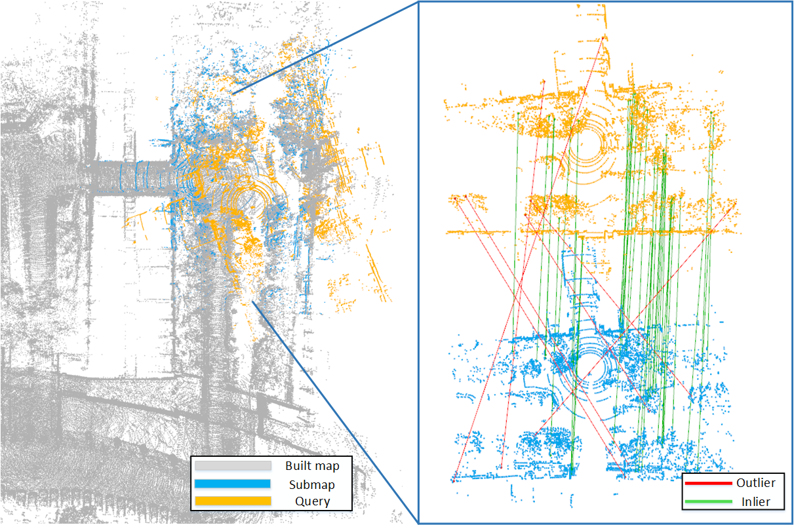

# PLReg3D: Learning 3D Local and Global Descriptors Jointly for Global Localization

## Introduction
This is our M2VIP 2021 work. The procedure of PLReg3D is explained as follows.
For a query point cloud, we first use KNN to find the most similar point cloud
based on its global descriptor, and exclude those that are not similar, which gets a coarse pose in the global coordinate
system. Then, based on the local descriptors, we register the query point
cloud and its most similar point cloud to further obtain an accurate pose.

## Citation
If you find this work useful, please consider citing:
```latex
    @inproceedings{qiao2021plreg3d, 
    title={PLReg3D: Learning 3D Local and Global Descriptors Jointly for Global Localization}, 
    author={Zhijian Qiao, Hanwen Wang, Yu Zhu, Hesheng Wang}, 
    booktitle={The IEEE 27th International Conference on Mechatronics and Machine Vision in Practice (M2VIP 2021)},
    year={2021} 
    }
 ```


## Environment and Dependencies
Our network is built on the [MinkowskiEngine](https://github.com/StanfordVL/MinkowskiEngine).

The system requirements are:
* Ubuntu 14.04 or higher
* <b>CUDA 10.1.243 or higher</b>
* python 3.6 or higher
* GCC 7

The following Python packages are required:
* PyTorch (version 1.7)
* MinkowskiEngine (version 0.5)
* pytorch_metric_learning (version 0.9.94 or above)
* tensorboard
* pandas
* psutil
* bitarray
* open3d 0.11.0

Modify the `PYTHONPATH` environment variable to include absolute path to the project root folder: 
```export PYTHONPATH
export PYTHONPATH=$PYTHONPATH:PATH_TO_PRJECT
```

## Training
#### Global descriptor
Before training or evaluation, run the below code to generate pickles with positive and negative point clouds for each anchor point cloud.
```
cd generating_queries/ 

# generatte training tuples for kitti dataset
python generate_training_tuples_baseline_kitti.py
# generate evaluation tuples
python generate_test_sets_kitti.py

# generatte training tuples for sjtu dataset
python generate_training_tuples_baseline_sjtu.py
# generate evaluation tuples
python generate_test_sets_sjtu.py
```

Before training the network, edit the configuration file. Set dataset_folder parameter to the dataset root folder. Modify batch_size_limit parameter depending on available GPU memory. Default limit (=256) requires at least 11GB of GPU RAM.

To train the network, run
```
cd ..
#train on sjtu dataset
python training/MLR/train.py --config ./config/MLR/config_baseline_sjtu_nofix.txt --model_config ./models/minkloc3d.txt

#train on kitti dataset
python training/MLR/train.py --config ./config/MLR/config_baseline_kitti_nofix.txt --model_config ./models/minkloc3d.txt
```


#### Local descriptor
The network for registration depends on pretrained [FCGF models](https://github.com/chrischoy/FCGF#model-zoo). Please download corresponding models before training.

Before training the network, edit the configuration file. Set dataset_folder and other parameters needed in training. To train the network, run
```
# train on sjtu dataset
python training/DGR/train.py --config ./config/DGR/config_sjtu_debug.json

# train on kitti dataset
python training/DGR/train.py --config ./config/DGR/config_kitti_debug.json
```


## Pre-trained Models
Pretrained models for **global descriptor** are available in `weights` directory, while those for **local descriptor** are 
available in `pretrain` directory.


## Testing
To evaluate trained models for **global descriptor**, run the following commands:
```
#evaluate on sjtu
python eval/evaluate.py --config ./config/MLR/config_baseline_sjtu_fix.txt --model_config ./models/minkloc3d.txt

#evaluate on kitti
python eval/evaluate.py --config ./config/MLR/config_baseline_kitti_fix.txt --model_config ./models/minkloc3d.txt
```

To evaluate trained models for **local descriptor**, run the following commands:
```
# test on sjtu dataset
python ./scripts/test_kitti.py --config ./config/DGR/config_sjtu_debug.json

# test on kitti dataset
python ./scripts/test_kitti.py --config ./config/DGR/config_kitti_debug.json
```

## Experiment
Here is an experimental result of PLReg3D on sjtu dataset.




## Acknowledgements
[MinkLoc3D](https://github.com/jac99/MinkLoc3D)

[Deep Global Registration](https://github.com/chrischoy/DeepGlobalRegistration)


[comment]: <> (@InProceedings{Komorowski_2021_WACV,)

[comment]: <> (        author    = {Komorowski, Jacek},)

[comment]: <> (        title     = {MinkLoc3D: Point Cloud Based Large-Scale Place Recognition},)

[comment]: <> (        booktitle = {Proceedings of the IEEE/CVF Winter Conference on Applications of Computer Vision &#40;WACV&#41;},)

[comment]: <> (        month     = {January},)

[comment]: <> (        year      = {2021},)

[comment]: <> (        pages     = {1790-1799})

[comment]: <> (    })

[comment]: <> (   @inproceedings{choy2020deep,)

[comment]: <> (     title={Deep Global Registration},)

[comment]: <> (     author={Choy, Christopher and Dong, Wei and Koltun, Vladlen},)

[comment]: <> (     booktitle={CVPR},)

[comment]: <> (     year={2020})

[comment]: <> (   })
   
[comment]: <> (   @inproceedings{choy2019fully,)

[comment]: <> (     title = {Fully Convolutional Geometric Features},)

[comment]: <> (     author = {Choy, Christopher and Park, Jaesik and Koltun, Vladlen},)

[comment]: <> (     booktitle = {ICCV},)

[comment]: <> (     year = {2019})

[comment]: <> (   })
   
[comment]: <> (   @inproceedings{choy20194d,)

[comment]: <> (     title={4D Spatio-Temporal ConvNets: Minkowski Convolutional Neural Networks},)

[comment]: <> (     author={Choy, Christopher and Gwak, JunYoung and Savarese, Silvio},)

[comment]: <> (     booktitle={CVPR},)

[comment]: <> (     year={2019})

[comment]: <> (   })


